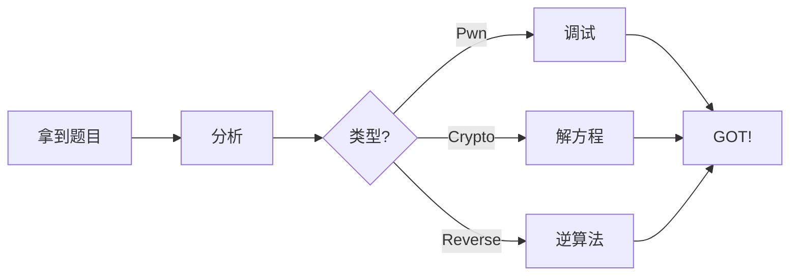

# 在 Markdown 中引用图片和文件

本站图片统一放在 `docs/assets/images/`,这篇演示各种图片、附件、流程图的引用写法。

<!-- more -->

本站的图片统一放在 `docs/assets/images/` 目录下。

## 基本图片

相对路径(推荐):

```markdown

```

效果:


## 带标题的图片(Material 特性)

```markdown
<figure markdown>
  
  <figcaption>题目:已知 n e c,求 m</figcaption>
</figure>
```

<figure markdown>
  
  <figcaption>这就是一张带说明的图片</figcaption>
</figure>

## 调整大小

```markdown
{: width="300"}
```

{: width="300"}

## 图片合并(lightbox 点击放大)

Material 默认支持 lightbox:点击图片即可放大查看,无需额外配置。

## 外链图片

直接填 URL 即可:

```markdown

```

## 附件文件(非图片)

链接到仓库里的文件:

```markdown
[下载题目附件](../../assets/challs/example.zip)
```

或者直接链接到 GitHub 的 Releases:

```markdown
[下载: chall.zip](https://github.com/bishouyou/bishou-blog/releases/download/v1.0/chall.zip)
```

## 结合 Mermaid 画图(已配置)

MkDocs 已经配置了 mermaid 支持,可以画流程图:



## 最佳实践总结

| 资源类型 | 存放位置 | 引用方式 | 要点 |
| --- | --- | --- | --- |
| 截图/素材 | `docs/assets/images/` | `../../assets/images/xxx.png` | 相对路径,注意层级 |
| 附件 | `docs/assets/challs/` | `../../assets/challs/xxx.zip` | 小心仓库大小,大文件扔 Release |
| 外链图 | 任何 URL | `` | 服务下线后会失效 |
| 流程图 | 内嵌 | ````mermaid ...```` | 零依赖,纯文本 |
| 大文件 | GitHub Releases | 外部链接 | 避免仓库膨胀 |

> 提示:GitHub Pages 单文件最大 **100 MB**,建议图片控制在 1-2 MB 以内,用 TinyPNG 或类似工具压缩后上传。